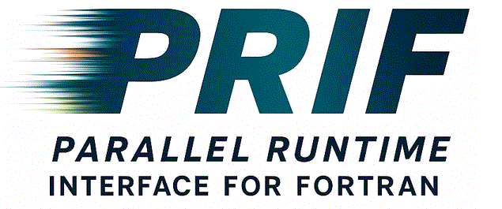

# PRIF Publications (prif-pubs)

This reposistory hosts publications relevant to the 
Parallel Runtime Interface for Fortran (PRIF) Specification.
It also serves as a public forum for discussion surrounding such publications.

* Relevant publications appear in the [pubs](pubs) directory.
* The latest version of the PRIF specification is also [published here](https://go.lbl.gov/prif)

## Citing PRIF

When citing PRIF in publication, please use the following citation:

* Dan Bonachea, Katherine Rasmussen, Brad Richardson, Damian Rouson.
"[**Parallel Runtime Interface for Fortran (PRIF): A Multi-Image Solution for LLVM Flang**](https://github.com/BerkeleyLab/caffeine/wiki/pubs/LLVM-HPC24_PRIF.pdf)",
Proceedings of the [Tenth Annual Workshop on the LLVM Compiler Infrastructure in HPC (LLVM-HPC2024)](https://web.archive.org/web/20241006163246/https://llvm-hpc-2024-workshop.github.io/), November 2024.  <https://doi.org/10.25344/S4N017>

## How to get involved

We welcome collaboration!

If you have feedback about a PRIF publication, please [open an issue](../../issues).
Please try to keep each issue focused on ONE particular topic.

The PRIF spec committee currently holds monthly virtual meetings, which are open to all interested parties.
Meetings are announced on the [public mailing list](https://groups.google.com/g/prif-spec).

## Governance

All modifications to the PRIF specfication are governed by the processes documented in the
[Governance for the PRIF Specification](https://go.lbl.gov/prif-governance)
and by the policies documented in the
[Code of Conduct for the PRIF Specificiation Community](https://go.lbl.gov/prif-code-of-conduct).

## License

Unless otherwise specified, all documents and other intellectual property
in this repository are licensed under the terms of
[CC BY-ND v4.0](https://creativecommons.org/licenses/by-nd/4.0/).
For more details, see [LICENSE.txt](LICENSE.txt).

## Contact

If you would like to learn more about the PRIF specification or surrounding efforts, 
you may want to search, email or join the 
[public Google group](https://groups.google.com/g/prif-spec) 
[prif-spec@googlegroups.com](mailto:prif-spec@googlegroups.com)
